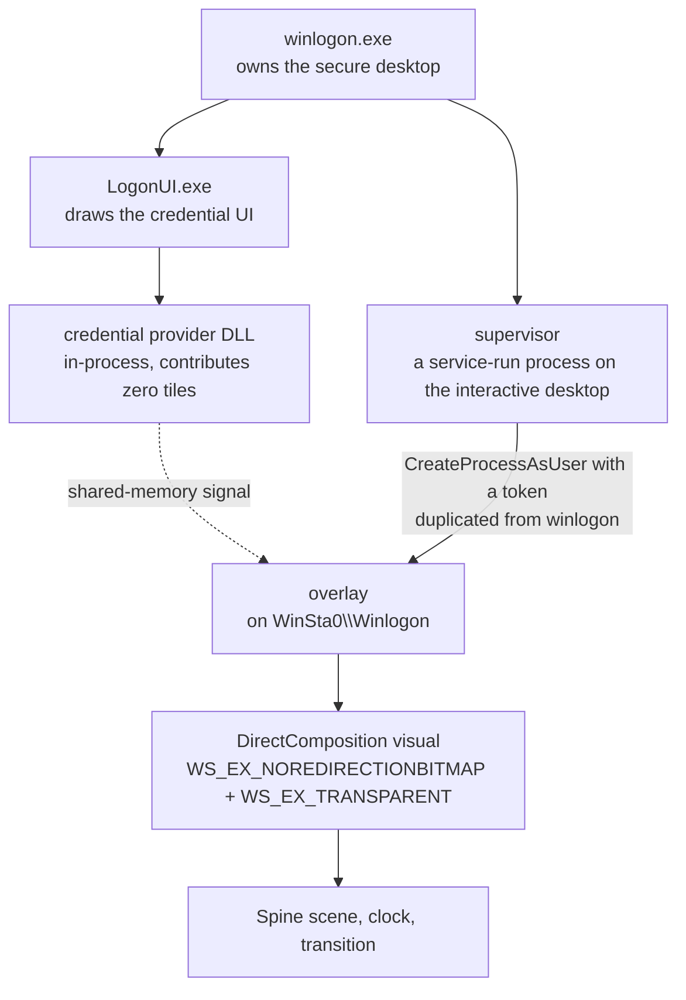

# shittim-logon

Replacing the Windows 11 logon screen with a live-rendered Spine scene.

**This repository is the concept and the adapter. It is not the product and it will
not build.** There are no game assets in it, no installer, and no Spine runtime. 

---

## 中文说明

这个仓库放的是**概念和适配器**，不是可运行的产物。

- 仓库里**没有任何游戏资产**，也没有 Spine 运行时，
  所以它**编译不起来**。

**如果你装了发行版，而登录屏出了问题：在登录屏上按 `Ctrl + Alt + F11`。**以临时禁用大部分功能。

---

## What it does

Windows draws the logon screen. This does not replace it — it draws *over* it, on the
same desktop, underneath the password box.



Three constraints shape everything else.

**The overlay runs on the secure desktop.** A normal process cannot draw there. The
supervisor runs as SYSTEM, opens `winlogon.exe`, duplicates its token, and starts the
overlay with `CreateProcessAsUser` against `WinSta0\Winlogon`. The overlay is therefore
a separate process on a desktop that ordinary tools cannot attach to or screenshot.

**It must never take input, and the obvious way of arranging that does not work.**
The window is `WS_EX_TRANSPARENT | WS_EX_NOACTIVATE` and answers `WM_NCHITTEST` with
`HTTRANSPARENT`, which is the documented arrangement for a click-through window. On a
`WS_EX_NOREDIRECTIONBITMAP` window composed through DirectComposition, **it does not
produce click-through.** Measured rather than reasoned about: the same click signs the
machine in with the overlay moved aside and does nothing with it in place.

Worse, `WindowFromPoint` reports that it *does* pass through. That reading is real and
it is not the question the mouse asks, so a hit test is not evidence here — a real
click is.

What does work is a window region. `SetWindowRgn` clips the composed content and the
input together, so a hole in it is a rectangle the OS owns completely. That is also the
limit of it: **on this desktop, drawing and input cannot be separated.** Anything the
overlay is allowed to draw over, it also swallows clicks on; anything it hands back for
clicking, it cannot draw on. There is no arrangement of styles, alpha or hit-testing
that gets both, and per-pixel alpha through `UpdateLayeredWindow` was measured
swallowing clicks too, where the alpha is zero. Every design above this line follows
from that one sentence.

A logon screen that eats input is a machine its owner cannot get into, so the rescue
hatch is not optional: `Ctrl + Alt + F11` takes it off the screen and leaves a marker
that keeps it off.

**The credential provider contributes nothing.** It is a real credential provider DLL,
loaded in-process by LogonUI, and it returns zero tiles. It exists to notice that an
enumeration round happened and raise a shared-memory signal. A provider that
contributed a tile is a provider that can lock somebody out.

## The parts that are hard

### The seam

The OS shows a wallpaper before the overlay composites, and again if the overlay goes
away. If that wallpaper and the live render are not the same picture, the switch
between them is visible.

So the scene is rendered twice by two different renderers: ahead of time to a PNG by a
software rasteriser (`adapter/raster.h`), and live in D3D11. Measured here, the two
agree to **zero pixels of translation**, median difference 1/255 across the frame.

Three things have to be shared rather than reimplemented on each side:

- **The camera** (`adapter/scene.h`) — a uniform-cover projection. A 3:2 screen crops
  differently from a 16:9 one and never stretches. A renderer that scales the axes
  independently matches at one aspect ratio and is wrong at every other.
- **The filename.** One function builds it. Three separate pieces of code have to name
  the same file; when the third disagreed, the wrong room was flashed over the right
  one with nothing in any log.
- **The gain.** How bright a room settles is a property of the scene, not a flag on
  either renderer.

### Drawing the room without the people in it

The wallpaper is the room with the characters removed, because the overlay draws them
live on top. Bake them in as well and one of them sits at a desk while another walks
into the foreground at the same time.

A Spine skeleton has no "this slot is furniture" flag. `adapter/scene.h` classifies
slots by attachment-name convention and by draw-order range. That classification was
written against one export and was wrong three times as more arrived: a convention that
held for slots A–F and not G, a rule that matched a character's slot as furniture, and
a prefix style only one export used. Each version was correct for every export
available when it was written.

### Knowing a person is there

The animation plays when somebody arrives — not on a timer, not at boot.

On Windows 11 a lock does not put a window on the desktop; it switches to a different
desktop, so there is nothing to observe from where the overlay sits. What is observable
is the input desktop coming back, which happens when a person dismisses it. Input on
the secure desktop is visible through `GetLastInputInfo`: measured, one keystroke and
the wake fired 12 ms later.

Movement is not arrival, and separating the two is most of the work. The OS's own
lock screen is dismissed by a click, a key or a swipe -- never by the pointer crossing
it -- and `GetLastInputInfo` reports that input happened without saying what it was.
The discriminator is the cursor's position, and one sample of it is not enough: the
timestamp has to be read *before* the position or a movement landing between the two
calls reads as a click, input within 150 ms of the pointer's last pixel change belongs
to that movement, and what survives both still has to hold still to count.

Biometrics are unsolved. A fingerprint or a face produces no input, so every
input-shaped trigger misses it. The only signal that sees one is the credential
provider's enumeration round, and that round also fires while the lock screen is still
up with nobody there.

### Measuring anything at all

A logon screen cannot be screenshotted by ordinary tools, and DirectComposition content
does not appear in a GDI grab. On the VM this was developed against, the console
thumbnail channel returned frames days old — no error, at every requested size, so a
"have the frames changed?" check certified them as fresh.

What works is asking the renderer instead of the screen: the overlay reads back its own
render target and encodes it. Full resolution, available the instant it draws, and it
cannot be stale, because the process that wrote the file is the process that drew it.

A check that the thing being checked can satisfy on its own is not a check.

## What is in here

```
adapter/
  scene.h            the camera, and slot classification for drawing a room
                     without its characters
  scenes.h           the scene table and config format (placeholder table — see below)
  raster.h           a small software rasteriser for Spine render commands
  image.h            PNG in and out
  render_still.cpp   the worked example: skeleton in, PNG out
```

## What is not in here

- **Any game asset.** No skeletons, no atlases, no textures, no fonts.
- **The real scene table.** `adapter/scenes.h` carries the mechanism with a placeholder
  table. The real rows name one game's animations and how they combine.
- **The Spine runtime.** Third-party, separately licensed.
- **The installer, the credential provider, and the overlay's Windows guts.**
- **Screenshots.**

## Licence

MIT, see `LICENSE`. That covers this project's own code and nothing else; see
`NOTICE.md`.
