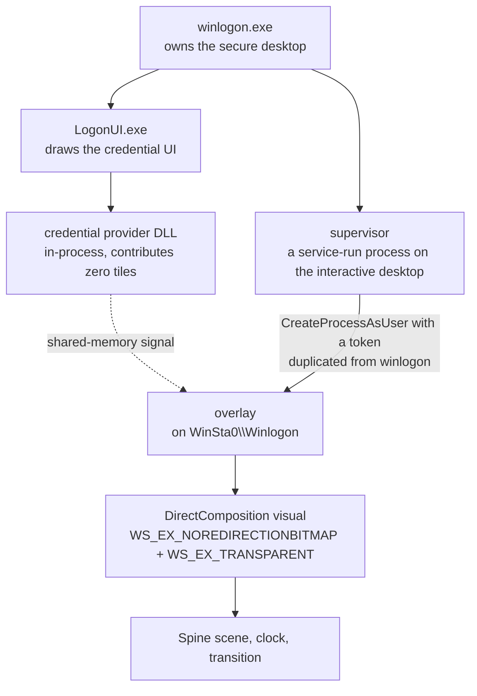

# shittim-logon

Replacing the Windows 11 logon screen with a live-rendered Spine scene.

**This repository is the concept and the adapter. It is not the product and it will
not build.** There are no game assets in it, no installer, and no Spine runtime — the
installable build is distributed separately. What is here is the part worth reading:
how you get a Spine skeleton onto a Windows logon screen at all, and the handful of
things that turn out to be hard about it.

---

## 中文说明

这个仓库放的是**概念和适配器**，不是可运行的产物。

- 仓库里**没有任何游戏资产**（骨骼、图集、贴图一个字节都没有），也没有 Spine 运行时，
  所以它**编译不起来**，这是有意的。
- 可安装的版本单独分发，不在 GitHub 上。
- 想看的是「怎么把一个 Spine 场景放到 Windows 登录屏上」这件事本身，以及做这件事时
  真正难的那几个点 —— 那些都在下面和 `adapter/` 里。

**如果你装了发行版，而登录屏出了问题：在登录屏上按 `Ctrl + Alt + F11`。**
它会立刻停掉覆盖层并写一个标记，之后每次登录都不再启动，直到你重新运行安装程序。
这个快捷键在界面上没有任何提示，是故意的 —— 屏幕上多一行字，就等于每天提醒你一次
这东西可能会坏。

---

## What it does

Windows draws the logon screen. This does not replace it — it draws *over* it, on the
same desktop, underneath the password box.



Three things make that possible and each one is a constraint on everything else:

**The overlay has to be on the secure desktop.** A normal process cannot draw there.
The supervisor runs as SYSTEM, opens `winlogon.exe`, duplicates its token, and starts
the overlay with `CreateProcessAsUser` against `WinSta0\Winlogon`. Nothing about this
is a hack — it is the documented way — but it does mean the overlay is a separate
process from anything you can debug normally, on a desktop you cannot screenshot with
ordinary tools.

**It must never take input.** The window is `WS_EX_TRANSPARENT | WS_EX_NOACTIVATE` and
answers `WM_NCHITTEST` with `HTTRANSPARENT`. Every click, every keystroke, every
Windows Hello prompt goes to the credential UI as if the overlay were not there.
A logon screen that eats input is a machine its owner cannot get into.

**The credential provider observes and contributes nothing.** It is a real credential
provider DLL loaded in-process by LogonUI, and it returns **zero tiles**. Its only job
is to notice that an enumeration round happened and raise a shared-memory signal, so
the overlay can know a person is arriving. A provider that contributed a tile would be
a provider that can lock somebody out.

## The parts that are actually hard

### The seam

The OS shows a wallpaper before the overlay composites, and again if the overlay ever
goes away. If that wallpaper and the live render are not the same picture, the switch
between them is visible — and it is visible in a way that reads as "this software is
broken" rather than "this software is loading".

So the same scene is rendered twice by two different renderers: once ahead of time to
a PNG, by a **software rasteriser** (`adapter/raster.h`), and once live in **D3D11**.
They have to agree. In this project they were measured agreeing to **zero pixels of
translation**, with a median difference of 1/255 across the frame.

Getting there needs three things to be shared rather than reimplemented:

- **The camera.** `adapter/scene.h` — a uniform-cover projection, so a 3:2 screen crops
  the same scene differently from a 16:9 one but never stretches it. Any renderer that
  scales the axes independently instead will match at one aspect ratio and be wrong at
  every other.
- **The filename.** One function builds it. Three separate pieces of code have to agree
  on which file a scene's still lives in; when the third disagreed, the symptom was the
  wrong room flashed over the right one, with nothing in any log to say so.
- **The gain.** How bright the room settles is a property of the *scene*, not a flag on
  either renderer, for exactly the same reason.

### Drawing the room without the people in it

The wallpaper has to be the room with the characters *removed*, because the overlay
draws them live on top. Bake them into the wallpaper as well and you get one of them
sitting at a desk while another walks into the foreground, at the same time.

A Spine skeleton does not come with a "this slot is furniture" flag. `adapter/scene.h`
classifies slots by their attachment-name conventions and by which draw-order range
they fall in. That classification was written against one export and was wrong three
separate times as more exports arrived — a naming convention that held for slots A–F
and not G, a rule that matched a character's slot as furniture, and a prefix style that
only one export used. It is worth reading as an example of the class of bug where the
code is correct for every input you have.

### Knowing a person is there

The animation should play when somebody arrives, not on a timer and not at boot.

That turns out to be the hardest single question in the project. On Windows 11 a lock
does not put a window on your desktop — it switches to a *different desktop*, so there
is nothing to observe from where the overlay sits. What can be observed is the input
desktop coming back, which happens exactly when a person dismisses it. Input on the
secure desktop is also visible through `GetLastInputInfo`, and it works: measured, one
keystroke and the wake fired 12 ms later.

**What has no answer yet is biometrics.** A fingerprint or a face produces no input at
all, so every input-shaped trigger misses it. The only signal that can see one is the
credential provider's enumeration round — and that round also fires while the lock
screen is still up with nobody there, which is why it is off by default. This is a real
open problem, not a to-do.

### Measuring anything at all

A logon screen is the hardest surface in Windows to observe. It cannot be screenshotted
by ordinary tools, DirectComposition content does not appear in a GDI grab, and on the
VM this was developed against the console thumbnail channel silently returns frames
that are *days* old — with no error, at every requested size, so a "have all the frames
changed?" check happily certifies them.

The answer that worked: **ask the renderer, not the screen.** The overlay reads back its
own render target and encodes it. Full resolution, never stale, available the instant it
draws, and it cannot lie about which frame it is, because the process that wrote the
file is the process that drew it.

If you take one thing from this repository, take that one. A verification step that the
thing being verified can satisfy on its own is not a verification step.

## What is in here

```
adapter/
  scene.h            the camera, and slot classification for drawing a room
                     without its characters
  scenes.h           the scene table and config format (placeholder table — see below)
  raster.h           a small software rasteriser for Spine render commands
  image.h            PNG in and out
  render_still.cpp   the worked example: skeleton in, PNG out
```

## What is deliberately not in here

- **Any game asset.** No skeletons, no atlases, no textures, no fonts. Not one byte.
- **The real scene table.** `adapter/scenes.h` ships the mechanism with a placeholder
  table in it. The actual rows are a catalogue of one particular game's animation names
  and how they combine; that is somebody else's material, not this project's.
- **The Spine runtime.** Third-party, separately licensed. Bring your own.
- **The installer, the credential provider, and the overlay's Windows guts.** The
  concept is described above; the shipping build is distributed separately.
- **Screenshots.** On purpose.

## Licence

The code in this repository is MIT — see `LICENSE`. That covers this project's own
work and nothing else; see `NOTICE.md`.
